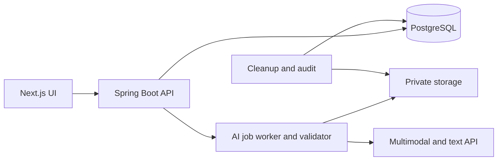
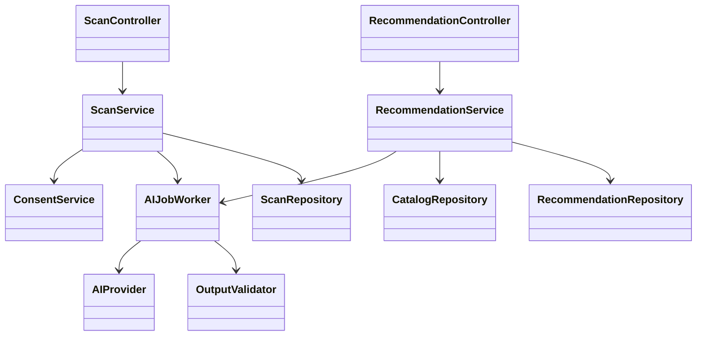
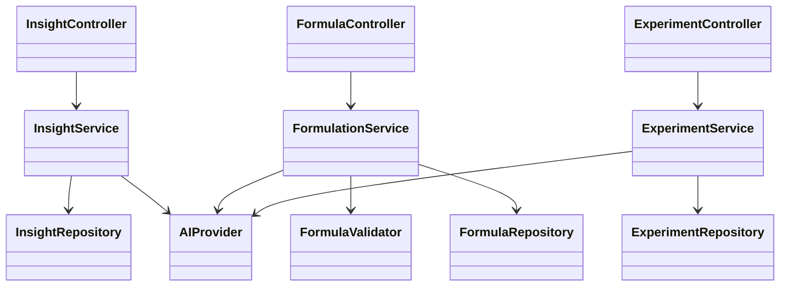
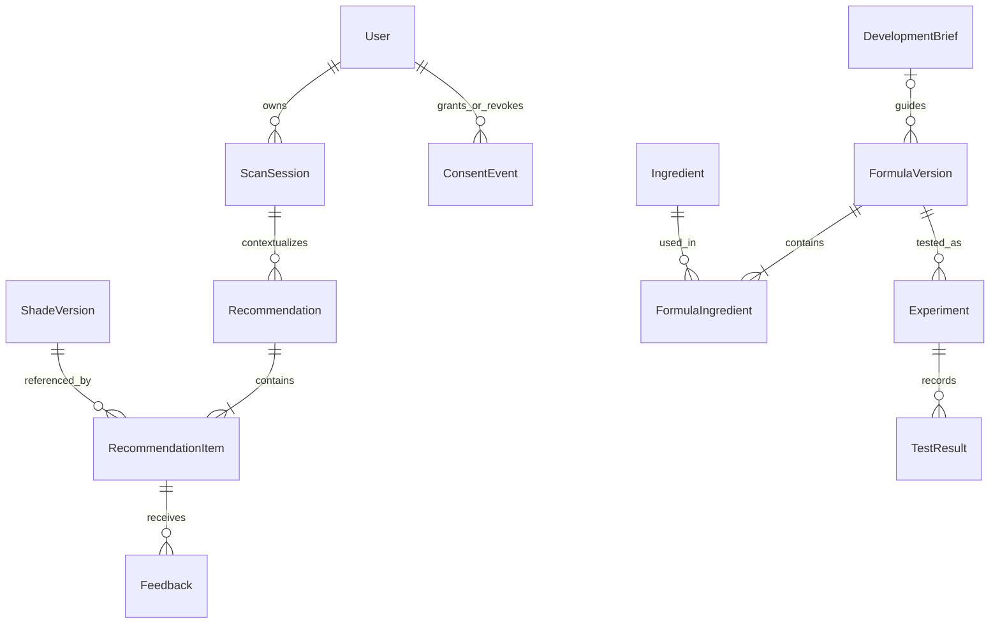

# FormuSense - Lipstick Shade Intelligence

Low Level Technical Document

Rekomendasi lipstik berbasis estimasi undertone dan profil bibir, dengan feedback konsumen yang kembali ke R&D.

| Versi | Tanggal | Status |
| --- | --- | --- |
| 2.0 | 16 September 2026 | Revisi konsep closed-loop lipstick shade |

**Disiapkan untuk:** Tim hackathon FormuSense. Nama anggota dan penanggung jawab diisi oleh tim pada saat pembagian tugas.

**Empat fitur utama / 11 subfitur:** (1) Consumer Scan & Profile, (2) Lipstick Shade Recommendation, (3) Consumer Feedback, dan (4) R&D Intelligence Workspace. Shade Atlas, gap alert, development brief, AI Formula Draft, dan Experiment Memory berada dalam fitur R&D.

**Asumsi pengerjaan:** web responsif, satu organisasi R&D, satu jenis lipstik, API AI multimodal, dan katalog awal 20-40 shade lipstik terkurasi. Angka ini adalah batas scope demo, bukan kecukupan statistik untuk validasi kecocokan warna.

**Status bukti:** ini spesifikasi yang akan dibangun. Belum ada klaim aplikasi selesai, analisis undertone akurat, studi hedonik terkontrol, uji laboratorium lulus, atau dataset lipstick terhubung telah tersedia.

**Acuan struktur:** B11 - Low Level Technical Document / EventSphere, 34 halaman. Struktur teknis diadaptasi; data acara, tiket, transaksi, nama pengarang, dan hasil proyek lama tidak digunakan sebagai fakta FormuSense.

**Prinsip implementasi**
- API AI membaca konteks, merangkum, dan mengusulkan kandidat.
- Aplikasi memeriksa hak akses, ID sumber, komposisi, biaya, dan status data.
- Estimasi visual dan skor kecocokan AI berbeda dari rating konsumen setelah pemakaian.
- Keberhasilan formula dinilai melalui pengukuran, uji fisik/stabilitas, dan evaluasi yang relevan.

---

# Summary & peta dokumen

FormuSense menghubungkan pemilihan shade dengan pengembangan produk. Konsumen boleh mengunggah foto wajah/bibir dan memilih preferensi; keduanya opsional. AI memperkirakan undertone, skin tone, dan karakteristik bibir yang tampak, lalu aplikasi merekomendasikan tiga shade dari katalog. Feedback preview dan setelah pemakaian dipisah. Dengan izin kontribusi, agregat feedback membentuk Shade Atlas, gap alert, dan development brief bagi formulator. Draft formula berbasis referensi dan hasil eksperimen melengkapi siklus tersebut.

| Bagian | Halaman | Isi |
| --- | --- | --- |
| Functional Requirements | 3-6 | Aktor, alur utama, validasi, dan keadaan gagal |
| Non-Functional Requirements / Out of Scope | 7 | Target kualitas dan batas MVP |
| Proposed Low-Level Architecture | 8-13 | Modul, diagram kelas, relasi, dan data dictionary |
| Dependencies / Components | 14 | Stack, dependensi, dan konfigurasi |
| Desain API | 15-18 | Endpoint, DTO, status, dan kontrol akses |
| AI Contracts / Decision Logic | 19-20 | Pembagian kerja AI dan aturan aplikasi |
| Security | 21 | Autentikasi, persetujuan, retensi, dan audit |
| Solusi Alternatif / Scalability | 22 | Trade-off dan target beban |
| Execution Plan | 23 | Urutan pengerjaan dan pembagian pekerjaan |
| Cost / Production Readiness | 24 | Anggaran, deployment, dan observability |
| Validation / Demo | 25-26 | Acceptance tests dan skenario presentasi |
| References / Handover | 27 | Sumber dan keputusan yang belum ditetapkan |
| Lampiran implementasi | 28 | Sumber, aset, job lifecycle, dan aturan transaksi |

**Peta empat fitur:** Scan & Profile -> Shade Recommendation -> Consumer Feedback -> R&D Intelligence -> kandidat shade/formula baru. Compose menjadi AI Formula Draft; What If menjadi perbandingan kandidat; Autopsy dan Memory menjadi evaluasi serta histori eksperimen.

**Hitungan 11 subfitur:** Scan (foto; preferensi opsional; analisis/koreksi profil) = 3. Recommendation (tiga pilihan; GenAI Personal Note; Community Hedonic Spectrum) = 3. Feedback (Preview Interest; After-Use Review) = 2. R&D (Shade Atlas; gap alert/brief; formula draft/experiment memory) = 3.

**Peran:** Guest membaca katalog; Consumer mengelola scan dan feedback miliknya; Formulator mengelola R&D dan melihat agregat yang memenuhi syarat; Admin mengelola katalog, akses, dan operasi. Admin tidak otomatis mendapat akses foto konsumen.

**Keputusan terbuka:** provider, izin sumber swatch/foto/formula, durasi lomba, katalog lipstik nyata, serta pasangan formula-hasil shade. Data yang belum tersedia tidak boleh disamarkan sebagai hasil pengukuran.

---

# Functional Requirements: akses & katalog

**FR-01 - Authentication and Authorisation**
1. Guest mendaftar dengan email dan password. Backend membuat Consumer; role dari payload klien ditolak.
2. Login memverifikasi hash password. Session ID dirotasi dan disimpan dalam cookie HttpOnly. Logout menghapus sesi server serta cookie.
3. Admin membuat atau menetapkan akun Formulator. Akun admin pertama disediakan melalui konfigurasi seed privat, bukan endpoint registrasi publik.
4. Semua operasi milik pengguna memeriksa owner_id di service. Mengetahui UUID orang lain tidak memberikan akses.

**Validasi:** email unik yang dinormalisasi; password 12-128 karakter; pesan login generik; throttle login. Tidak mengumpulkan nomor telepon atau tanggal lahir untuk fungsi shade. MVP meminta konfirmasi pengguna dewasa; verifikasi usia produksi menjadi keputusan tersendiri.

**FR-02 - Shade Catalog**
Admin dapat membuat, memperbarui, mengarsipkan, dan mengimpor katalog lipstik. Guest dan Consumer hanya melihat shade ACTIVE. Field wajib: code, name, product_type, color_family, intensity, finish, coverage, swatch_asset_id, provenance, dan source_id. Tabel ShadeUndertoneAffinity berisi undertone, kecocokan kurasi, alasan, serta sumber per versi shade. Warna RGB/hex untuk tampilan saja, bukan hasil kolorimetri atau rasio pigmen.

**Aturan data:** SKU/code unik; jenis produk dibatasi LIPSTICK untuk MVP. Intensitas dan affinity undertone dikurasi tim, bukan dikarang API saat inferensi. Sampel katalog, feedback, dan formula sintetis ditandai SYNTHETIC. Impor menawarkan dry-run, error per baris, dan penyimpanan atomik untuk batch valid.

**Versi dan histori:** update katalog menaikkan catalog_version. RecommendationItem menyimpan shade_version dan snapshot nama/atribut yang dipakai saat rekomendasi. Shade yang pernah direferensikan diarsipkan, bukan dihapus fisik.

**Keadaan gagal:** input tidak valid menghasilkan 422; konflik code atau versi menghasilkan 409; data tidak ditemukan 404; akses peran tidak sesuai 403. Tidak ada placeholder produk yang disajikan sebagai stok nyata.

**Kriteria penerimaan:** consumer tidak dapat menulis katalog; shade arsip tidak masuk rekomendasi baru; affinity undertone terlacak sumbernya; riwayat lama tetap terbaca dengan label produk diarsipkan.

---

# Functional Requirements: scan & rekomendasi

**FR-03 - Consumer Scan & Profile**
Foto wajah/area bibir dan pilihan selera sama-sama opsional. Estimasi skin tone/undertone hanya dicoba bila kulit sekitar wajah terlihat; foto bibir saja memberi profil bibir dan meminta undertone manual. Bila foto kosong, pengguna dapat memilih undertone sendiri atau memakai rekomendasi kurasi umum. Preferensi color_family, finish, coverage, dan desired_look hanya diterapkan jika dipilih. Sebelum upload, UI menjelaskan pemrosesan foto oleh penyedia AI; izin kontribusi R&D terpisah dan default tidak aktif.

1. Consumer mengunggah JPEG/PNG maksimum 5 MB dengan sisi minimum 256 px. Backend memeriksa signature file, batas 16 megapixel, lalu decode, menghapus EXIF, dan mengecilkan sisi terpanjang ke 1.024 px.
2. File masuk storage privat menggunakan key acak. URL dari pengguna tidak diterima sebagai sumber gambar untuk mencegah fetch alamat sembarang.
3. Backend membuat ScanSession dan AIJob. API mengembalikan 202 beserta job_id; browser melakukan polling dengan jeda meningkat.
4. API multimodal mengembalikan quality USABLE/RETAKE/UNCERTAIN; estimated_skin_tone; estimated_undertone WARM/COOL/NEUTRAL/OLIVE/UNCERTAIN; natural_lip_color dan tanda visual DRY_APPEARANCE, VISIBLE_CRACKS, TWO_TONED, UNEVEN_PIGMENTATION jika terlihat. Foto buruk menghasilkan NEEDS_INPUT.
5. Pengguna melihat batas estimasi dan dapat mengoreksi undertone/karakteristik. Simpan origin MODEL, USER_CONFIRMED, USER_CORRECTED, atau MANUAL; jangan menyebut hasil sebagai diagnosis kondisi/kesehatan bibir.

**FR-04 - Shade Recommendation**
Backend mengambil shade lipstik ACTIVE, menerapkan batas wajib, dan menghitung kecocokan undertone terkurasi serta preferensi yang tersedia. Tiga slot tampilan adalah DAILY_NATURAL, ENERGIZED_VIBE, dan BOLD_STATEMENT; tiap slot mencari kandidat dengan intensitas sesuai, tanpa mengorbankan batas wajib. API hanya dapat mengurutkan dan menjelaskan shortlist maksimum delapan ID katalog; tidak boleh menciptakan shade atau klaim hasil pakai.

**Output:** sampai tiga shade unik, peran slot, swatch, atribut, alasan, mode sumber undertone, dan keterbatasan. Angka kecocokan heuristik tidak ditulis sebagai probabilitas atau rating komunitas. Bila slot tidak punya kandidat layak, tampilkan lebih sedikit pilihan dan alasan; jangan mengisi slot dengan produk yang tidak memenuhi batas wajib.

**Fallback:** jika API foto gagal, pengguna dapat memilih undertone MANUAL_UNDERTONE. Jika undertone tidak tersedia, gunakan preferensi atau urutan katalog kurasi berlabel PREFERENCES_ONLY/CATALOG_CURATED. Foto dihapus setelah pekerjaan selesai sesuai kebijakan halaman 21.

**Kriteria penerimaan:** setiap kandidat adalah shade aktif dengan alasan yang merujuk data katalog; koreksi pengguna berlaku pada ranking; foto buruk dan API gagal memiliki jalur lanjut; profil visual tidak dipresentasikan sebagai diagnosis.

---

# Functional Requirements: feedback & insight

**FR-05 - Consumer Feedback**
Feedback merujuk recommendation_item_id, owner_id, dan stage; shade_version ditelusuri melalui item. Satu feedback aktif per item, pengguna, dan stage; revisi menaikkan version. Pengguna dapat menghapus feedback miliknya.

| Stage | Data yang boleh dicatat | Makna |
| --- | --- | --- |
| PREVIEW | Ketertarikan warna 1-5, pilihan kandidat, alasan | Hanya minat berdasarkan tampilan/preview |
| TRIED | Kesukaan warna, finish, tekstur, kenyamanan, overall 1-5; keluhan | Pengalaman setelah mencoba, self-reported atau lab-observed |

Pada PREVIEW, skor kenyamanan, tekstur, dan daya tahan wajib null. Pada TRIED, tried_at wajib; nilai yang belum dinilai tetap null. Keikutsertaan studi terkontrol memakai study_id. Rating komunitas biasa tidak boleh dinamai hasil uji hedonik terkontrol. Komentar maksimum 500 karakter.

**FR-06 - Community Spectrum & R&D Intelligence**
Layar konsumen menampilkan Community Hedonic Spectrum untuk cohort serupa bila jumlah data memadai. Label UI memisahkan AI Match (skor heuristik), Preview Interest, dan After-Use Satisfaction dengan n_users, periode, serta tahap. Tanpa data memadai tampilkan BELUM_CUKUP_DATA; jangan membuat angka seperti 9/10 melalui AI.

Indonesian Lipstick Shade Atlas menghitung distribusi pada pengguna aplikasi yang berizin, bukan populasi seluruh Indonesia. Formulator memilih periode dan cohort tetap (skin tone/undertone yang telah dikonfirmasi atau dilabel origin). Sistem menghitung jumlah orang, respons, preferensi, keluhan, dan ketersediaan shade. SQL menghasilkan metrik; AI hanya merangkum metrik dan menyusun draft development brief yang merujuk metric_id.

**Batas kelompok:** default minimum 10 responden unik per kelompok, sebagai kebijakan MVP untuk mengurangi paparan, bukan bukti anonimitas atau signifikansi statistik. Kelompok kecil disembunyikan dan tidak boleh dihitung kembali melalui total atau filter pembanding. MVP hanya menyediakan cohort tetap, tanpa filter bebas kombinasi.

**Unmet Demand Alert:** aturan menggabungkan permintaan/ketertarikan tinggi, sedikit shade katalog yang cocok, dan/atau kepuasan setelah pemakaian rendah. Alert membawa periode, n_users, metric_ids, status REAL/SYNTHETIC, dan keterbatasan. Ini hipotesis gap produk; bukan prediksi tren 6-12 bulan atau bukti permintaan pasar nasional.

**Kriteria penerimaan:** penolakan R&D tidak menghalangi rekomendasi; pencabutan mengecualikan kontribusi; PREVIEW/TRIED tidak tercampur; data nyata/demo diberi label; formulator tidak membuka foto, email, atau komentar mentah konsumen.

---

# Functional Requirements: AI formula & memory

**FR-07 - AI Draft Formula / Compose**
Formulator memilih development brief, base_formula_version_id, ukuran batch, mandatory/excluded ingredients, dan target lipstick. Backend memuat referensi yang diperiksa tim, data formula-hasil bila ada, serta batas eksplorasi. AI mengusulkan hipotesis rasio pigmen/basis, langkah proses, alasan, sumber, unknowns, dan rencana uji. Keluhan lengket menjadi pertanyaan eksperimen, bukan perintah otomatis mengganti satu solvent/filler.

Jika tidak ada formula referensi yang memadai, hasil berupa NEEDS_REFERENCE tanpa resep numerik. Jika hubungan komposisi dengan hasil shade belum diukur, kandidat diberi label hipotesis dan tidak mengklaim shade pasti tercapai. Validasi kimia dan klaim regulasi tidak disimpulkan dari lolosnya pemeriksaan struktur.

**FR-08 - Compare / What If**
Formulator dapat mengganti bahan atau konsentrasi pada salinan versi. Sistem menampilkan perubahan persentase, gram per batch, biaya bahan baku jika harga lengkap, dan dukungan bukti. Perubahan yang membuat total berbeda dari 100% ditolak; opsi balance hanya memakai bahan yang secara eksplisit ditetapkan formulator dan tetap memeriksa batasnya.

**FR-09 - Experiment Memory / Autopsy**
1. Formulator meninjau kandidat dan menetapkan READY_FOR_TEST. Status ini adalah persetujuan internal untuk diuji.
2. Experiment merujuk versi formula yang tidak dapat diubah, batch aktual, proses aktual, kondisi uji, dan observasi.
3. Setiap TestResult menyimpan parameter, nilai/unit atau outcome, metode, suhu, durasi, dan pass criterion. Kriteria dapat berbeda per jenis uji.
4. AI membandingkan eksperimen relevan, menyusun hipotesis, serta opsi uji berikutnya. Warna, tekstur, dan stabilitas dicatat terpisah. Tidak mengklaim penyebab pasti dari korelasi.

**Status formula:** DRAFT -> REVIEWED -> READY_FOR_TEST -> TESTED. REJECTED tersedia dari DRAFT/REVIEWED. TESTED berarti ada hasil uji tercatat, bukan berarti lulus seluruh uji. Edit setelah review membuat versi DRAFT baru. Publikasi shade ke katalog merupakan tindakan Admin terpisah setelah bukti ditinjau.

**Kriteria penerimaan:** formula bernomor memiliki total 100% dalam toleransi 0,01 poin persentase, seluruh bahan dan sumber valid, serta label kandidat. Pengujian yang belum dilakukan tidak boleh diisi sebagai PASSED.

---

# Non-Functional Requirements & Out of Scope

Semua angka berikut adalah target uji MVP, bukan hasil benchmark atau SLA produksi. Pengujian dilakukan pada konfigurasi deployment yang dicatat bersama hasilnya.

| ID | Requirement | Target penerimaan |
| --- | --- | --- |
| NFR-01 | Integritas rekomendasi | Semua ID kandidat ada di shortlist dan katalog aktif saat dibuat |
| NFR-02 | Integritas formula | Tidak menyimpan kandidat numerik yang gagal validasi total, bahan, atau sumber |
| NFR-03 | Privasi | Tidak ada foto, token, email, atau komentar mentah dalam log operasional |
| NFR-04 | Akses | Seluruh test lintas pemilik dan peran harus ditolak |
| NFR-05 | Respons API non-AI | p95 kurang dari 1 detik pada 20 sesi aktif, di luar transfer gambar |
| NFR-06 | Pekerjaan AI | Target p95 kurang dari 30 detik; deadline total 60 detik lalu fallback/error |
| NFR-07 | Ketahanan | Kegagalan AI tidak menghentikan katalog, input feedback, dan memory |
| NFR-08 | Aksesibilitas | Label formulir, navigasi keyboard, teks status, dan indikator tidak hanya warna |
| NFR-09 | Maintainability | Controller, service, repository, dan adapter AI terpisah; kontrak versi v1 |
| NFR-10 | Observability | Trace ID, durasi, status, model version, token usage, dan mode data tercatat |

**Out of Scope untuk hackathon**
- Pelatihan ulang model memakai wajah konsumen dan identifikasi biometrik individu.
- Virtual try-on fotorealistis, diagnosis kondisi bibir, serta inferensi etnis atau kondisi kesehatan.
- Prediksi kuantitatif warna hasil campuran, stabilitas, viskositas, atau shelf life yang diklaim tervalidasi tanpa model dan pengujian terkait.
- Prediksi tren 6-12 bulan, heatmap lokasi nasional, dan rekomendasi peluncuran lini produk otomatis tanpa data longitudinal serta validasi pasar.
- Formula otomatis yang langsung dirilis untuk produksi; sertifikasi safety, regulasi, atau klaim produk.
- Marketplace, pembayaran, stok live supplier, multi-organisasi, aplikasi mobile native, dan integrasi alat laboratorium.

**Tetap di dalam scope:** estimasi undertone/karakteristik bibir yang tampak, katalog lipstick terkurasi, Community Spectrum berdenominator jelas, gap alert berbasis aturan, draft pigmen/basis melalui API, dan pencatatan uji. Semua klaim dibatasi status bukti.

---

# Proposed Low-Level Architecture

Arsitektur menggunakan modular monolith: satu backend Spring Boot memuat modul domain, worker AI, dan scheduler retensi. Next.js menangani UI. Browser mengakses satu origin; gateway meneruskan /api/v1 ke backend. Tidak diperlukan microservices untuk MVP.



**Aliran data:** browser mengirim preferensi/foto -> backend memeriksa sesi dan consent -> worker memanggil API -> validator memeriksa hasil -> service menyimpan -> browser membaca status. Pemanggilan API AI tidak berada dalam transaksi database yang terbuka.

**Batas kepercayaan:** file, komentar, sumber, dan keluaran model diperlakukan sebagai input tidak tepercaya. Hanya server memegang API key dan dapat menulis data. Provider tidak mendapatkan kredensial database atau alat untuk mengubah status formula.

**Modul:** Identity & Consent; Catalog; Scan; Recommendation; Feedback; Insight; Formulation; Experiment; AI Gateway; Audit & Deletion. DTO di batas HTTP/AI terpisah dari entitas database.

**Job:** PostgreSQL menyimpan antrean dan lease. Worker bounded mengambil job dengan lock, melepas transaksi, memanggil provider, lalu commit hasil dengan pemeriksaan ulang cancellation dan consent. Pekerjaan yang melewati deadline ditandai FAILED atau CANCELLED; browser tidak menunggu request HTTP panjang.

---

# Low-level Class Diagram: consumer

Diagram menunjukkan kontrak utama, bukan setiap getter atau field framework. Arah panah menunjukkan penggunaan dependency; service memegang aturan bisnis dan repository menangani persistence.



| Komponen | Tanggung jawab utama |
| --- | --- |
| ScanService | Memeriksa owner/consent, mencatat job, koreksi profil, dan penghapusan |
| RecommendationService | Menghitung shortlist, memvalidasi urutan dan alasan AI, serta menyimpan snapshot |
| ConsentService | Memeriksa scope, versi notice, pilihan data, dan pencabutan |
| AIJobWorker | Claim lease, batas konkurensi, retry terkontrol, dan finalisasi atomik |
| AIProvider / OutputValidator | Memanggil provider dan memvalidasi hasil terstruktur terhadap konteks |

**Kontrak penting:** buildRecommendations(ownerId, scanId) hanya menerima scan READY atau MANUAL yang milik caller. saveProfile(jobId, expectedVersion, result) menolak hasil jika scan sudah dibatalkan, dihapus, atau consent layanan sudah dicabut.

**Pemisahan AI:** ranking heuristik dari affinity undertone dan preferensi tetap tersedia tanpa provider. AI boleh memilih di dalam shortlist dan menjelaskan kandidat; semua ID, slot, dan alasan diperiksa. AI tidak mengubah hak akses atau katalog.

---

# Low-level Class Diagram: R&D

R&D Workspace menghubungkan agregat feedback, brief, formula kandidat, dan hasil eksperimen. Akses foto konsumen tidak menjadi dependency modul formulasi.



| Komponen | Kontrak dan aturan |
| --- | --- |
| InsightService | aggregate(filters), communitySpectrum(), detectGap() dengan consent, cohort tetap, provenance, dan suppression |
| FormulationService | createDraft(briefId, baseVersionId, constraints) mengantrekan usulan |
| FormulaValidator | validate(total, ingredients, constraints, sourceIds) memberi error terstruktur |
| ExperimentService | record(versionId, actualBatch, tests) menyimpan fakta pengujian |
| AIProvider | draftFormula(context), summarizeMetrics(metrics), summarizeExperiments(records) |

**Review:** reviewDraft(id, expectedVersion) hanya tersedia bagi Formulator/Admin. AI tidak memiliki method untuk menyetujui formula. Jika diperlukan revisi, service membuat versi baru dan menjaga relasi parent_version_id.

**Konsistensi:** TestResult tidak mengubah formula historis. Perbaikan input hasil uji menghasilkan revision dan audit event; nilai lama tetap ditandai superseded dalam riwayat internal.

---

# Data model: relasi inti

Database relasional menyimpan hubungan yang dapat ditelusuri. UUID adalah primary key; seluruh waktu menggunakan UTC. Data sintetis dan nyata dibedakan oleh data_kind dan dataset_id, bukan oleh nama file saja.



**Relasi tambahan:** User 1:N ConsentEvent; ScanSession 1:N AIJob; Shade 1:N ShadeVersion; ShadeVersion 1:N ShadeUndertoneAffinity; Source 1:N FormulaSource; FormulaVersion N:M Ingredient melalui FormulaIngredient; FormulaVersion 1:N ShadeMeasurement; Experiment 1:N TestResult; InsightSnapshot 1:N DevelopmentBrief.

**Provenance:** FormulaSource menghubungkan versi formula dengan sumber dan locator halaman/bagian. ShadeMeasurement merujuk formula_version_id dan menyimpan metode, kondisi, serta hasil warna. Relasi pengukuran ini opsional: ketiadaannya harus menghasilkan status hubungan formula-shade belum terukur.

**Pemisahan konsumen dan R&D:** InsightSnapshot menyimpan angka agregat, cohort, stage, denominator, dan metric IDs untuk Spectrum, Atlas, serta gap alert. DevelopmentBrief tidak menyimpan wajah/identitas. Snapshot yang terpengaruh pencabutan ditandai STALE dan dibuat ulang sebelum digunakan.

**Integritas:** foreign key menjaga relasi; unique constraint mencegah duplikasi feedback dan versi. Total formula adalah aturan lintas baris yang diperiksa service dalam satu transaksi, bukan CHECK sederhana per bahan. Riwayat formula dikunci setelah direview. [R5]

---

# Data dictionary: identitas & konsumen

Notasi: PK primary key, FK foreign key; ? berarti nullable. UUID dan timestamptz digunakan kecuali ditulis berbeda. Field created_at, updated_at, dan version mengikuti kebutuhan mutasi.

| Entitas | Field utama | Constraint / catatan |
| --- | --- | --- |
| User | id PK; email; password_hash; role; active | Email unique; role CONSUMER / FORMULATOR / ADMIN |
| ConsentEvent | id PK; user_id FK; purpose; scope JSON; action; notice_version; occurred_at | Append-only; GRANT/REVOKE; purpose SERVICE_SCAN atau RND_ANALYTICS; scope memuat dataset/scan, jenis data, dan apakah mencakup riwayat |
| Source | id PK; title; url?; publisher?; edition?; locator?; excerpt?; rights_note; review_state; reviewed_by?; reviewed_at? | Evidence hanya dianggap reviewed setelah pemeriksaan tim; URL tidak di-fetch otomatis |
| Shade / ShadeVersion | id PK; code; status; current_version / shade_id FK; number; name; product_type; family; intensity; finish; coverage; look_tags; swatch_id; source_id | Unique code dan (shade_id, number); ACTIVE/ARCHIVED; product_type=LIPSTICK untuk MVP |
| ShadeUndertoneAffinity | shade_version_id FK; undertone; affinity; rationale; source_id FK | PK (shade_version_id, undertone); affinity 0-1 hasil kurasi, bukan angka klinis |
| ScanSession | id PK; owner_id FK; status; preferences JSON; visual_profile JSON?; corrected_profile JSON?; profile_origin; consent_event_id?; dataset_id; data_kind; expires_at | Visual profile memuat estimated_skin_tone, estimated_undertone, lip appearance tags, quality, limitations; koreksi pengguna menang |
| Asset | id PK; owner_id?; scan_id?; storage_key; mime; bytes; purpose; delete_after; deleted_at? | Privat untuk foto; purpose SCAN/SWATCH/EXPERIMENT; EXIF dibuang |
| Recommendation | id PK; owner_id; scan_id FK; catalog_version; algorithm_version; profile_origin; mode; input_snapshot; data_kind | mode AI_UNDERTONE/USER_CONFIRMED/MANUAL_UNDERTONE/PREFERENCES_ONLY/CATALOG_CURATED; snapshot tanpa foto |
| RecommendationItem | id PK; recommendation_id FK; shade_version_id FK; slot; rank; heuristic_score; reason; evidence_ids | Unique shade_version per recommendation; max tiga; slot DAILY_NATURAL/ENERGIZED_VIBE/BOLD_STATEMENT |
| Feedback | id PK; owner_id; recommendation_item_id FK; stage; ratings JSON; issue_codes; comment?; tried_at?; study_id?; verification; version; deleted_at? | Unique aktif (owner_id, item_id, stage); ratings integer 1-5 atau null; eligibility R&D dihitung dari consent aktif |

**Indeks minimum:** ScanSession(owner_id, created_at), Feedback(shade via item, stage, created_at), ConsentEvent(user_id, purpose, occurred_at), Shade(status, color_family), ShadeUndertoneAffinity(undertone, affinity). Password hash tidak pernah dikembalikan oleh DTO.

---

# Data dictionary: formula, eksperimen & AI

| Entitas | Field utama | Constraint / catatan |
| --- | --- | --- |
| Ingredient | id PK; INCI; trade_name; grade; role; active_fraction?; cost_per_kg?; currency?; cost_date? | Bahan komersial tidak disamakan hanya karena INCI sama; biaya nullable |
| FormulaVersion | id PK; formula_id; number; parent_version_id?; base_version_id?; brief_id?; status; batch_g; process_steps JSON; evidence_status; data_kind; version | Unique (formula_id, number); batch_g lebih dari nol; READY_FOR_TEST hanya melalui review manusia |
| FormulaIngredient | formula_version_id FK; ingredient_id FK; percent_w_w NUMERIC(7,4); phase; source_id?; rationale | PK gabungan; persen lebih dari nol dan maksimal 100; total 100 +/- 0,01 diperiksa atomik |
| FormulaSource | formula_version_id FK; source_id FK; claim; locator | Sumber mendukung klaim tertentu, bukan seluruh formula secara otomatis |
| IngredientConstraint | id; base_version_id FK; ingredient_id FK; min_pct?; max_pct?; source_id; set_by | Batas eksplorasi disetujui formulator; bukan jaminan legal atau safety |
| ShadeMeasurement | id; formula_version_id FK; experiment_id?; asset_id?; method; values JSON; conditions JSON; measured_at | Tampilan RGB dan pengukuran alat dibedakan; nilai warna harus menyebut metode/kondisi |
| Experiment / TestResult | id; formula_version_id; batch_actual_g; actual_process; performed_at / experiment_id; parameter; value?; unit?; outcome; method; duration; temperature; criterion; revision | Outcome PASS/FAIL/INCONCLUSIVE/NOT_TESTED; uji belum dilakukan tidak boleh PASS |
| InsightSnapshot / DevelopmentBrief | id; cohort; period; stage; metric_ids; denominators; data_kind; status; generated_at / snapshot_id?; gap_hypothesis; target; constraints | REAL/SYNTHETIC terpisah; snapshot STALE tidak dipakai membuat brief baru |
| AIJob | id; owner_id; purpose; entity_id; status; input_ref; endpoint; idempotency_key; request_hash; attempts; lease_until?; deadline; model; prompt_version; usage; error_code? | Unique (owner_id, endpoint, idempotency_key); tanpa foto/payload pribadi di log |
| AuditEvent / DeletionJob | id; actor_id?; action; resource_id; timestamp; metadata / owner_id; scope; state; requested_at; completed_at? | Audit metadata minimum; deletion memuat progress DB, storage, cache, dan provider bila relevan |

**Seed:** dataset_id membedakan demonstrasi sintetis dari data kurasi nyata. Semua relasi dalam sebuah alur harus konsisten data_kind-nya; sistem menolak feedback REAL terhadap rekomendasi SYNTHETIC.

---

# Dependencies & Components

Stack dasar mengikuti acuan B11: Next.js, Spring Boot, dan PostgreSQL. Versi kompatibel dipilih saat bootstrap dan dikunci dalam lockfile/build file; dokumen tidak mengklaim satu versi sebagai yang terbaru.

| Komponen | Pilihan rancangan | Alasan / dependency |
| --- | --- | --- |
| Web UI | Next.js + TypeScript | Katalog dan dashboard; komponen interaktif untuk kamera/formulir [R6] |
| Backend | Java Spring Boot; Spring Security; Validation | REST, session auth, DTO, service, dan pemeriksaan akses |
| Persistence | PostgreSQL; Spring Data JPA; Flyway | Relasi, transaksi, versioning, migrasi |
| Session | Spring Session JDBC | Sesi server dapat dicabut; cookie aman dan CSRF [R4] |
| AI client | AIProvider interface + RestClient adapter | Provider multimodal/teks dipanggil dari server; timeout dan parsing terkontrol [R3] |
| Storage | Private object storage; volume privat untuk demo lokal | Foto sementara; swatch publik dipisahkan |
| Jobs | Tabel AIJob + worker bounded; scheduler cleanup | Tidak memerlukan broker eksternal pada MVP |
| Testing | JUnit/MockMvc; browser E2E; contract fixtures | Memeriksa akses, alur, validator, dan kegagalan provider |
| Deployment | Container UI, backend, database; gateway HTTPS | Same-origin; data persisten lewat volume/storage |

**Urutan dependency:** Identity/Consent + lipstick catalog/undertone affinity -> Scan & Profile -> Recommendation -> Feedback -> Spectrum/Atlas/Gap -> DevelopmentBrief. Formula reference + Ingredient + Source -> AI Draft Formula -> Experiment Memory. Brief manual tetap tersedia sambil menunggu feedback nyata.

**Configuration:** DATABASE_URL, SESSION_SECRET bila diperlukan konfigurasi sesi, AI_BASE_URL, AI_MODEL_VISION, AI_MODEL_TEXT, AI_API_KEY, AI_JOB_DEADLINE_SECONDS=60, AI_MAX_CONCURRENT=2, IMAGE_TTL_MINUTES=60, RND_MIN_RESPONDENTS=10, DEMO_MODE, serta konfigurasi storage. Secret hanya di environment server/secret store; tidak diberi prefix publik frontend.

**Data dependency utama:** katalog shade lipstick, affinity undertone yang dikurasi, feedback per shade dan stage, serta referensi formula-hasil. Contoh Kaggle makeup/no-makeup [R9] tidak memberi label undertone; shades.csv [R10] berisi foundation; review Sephora [R11] khusus skincare. Ketiganya tidak otomatis menjadi pasangan foto-lipstick-rating. Shampoo [R7] hanya referensi metodologi.

---

# Desain API: standar, auth & katalog

Base path /api/v1, JSON UTF-8, timestamp ISO-8601 UTC, UUID sebagai ID. Endpoint list memakai page dan size (default 20, maksimum 100). Endpoint pemilik memakai sesi server; request mutasi membawa token CSRF. Detail objek milik orang lain dikembalikan sebagai 404.

| Method / path | Akses | Request -> response |
| --- | --- | --- |
| GET /auth/csrf | Publik | -> 200 token CSRF untuk sesi |
| POST /auth/register | Publik + throttle | email, password -> 201 user; role tetap CONSUMER |
| POST /auth/login | Publik + throttle | email, password -> 200 user + cookie session |
| POST /auth/logout | Login | -> 204; invalidate sesi server |
| GET /me | Login | -> 200 id, role, consent summary |
| PATCH /admin/users/{id}/role | Admin | role, version -> 200; audit perubahan |
| GET /shades | Publik | family, finish, coverage, intensity, page -> 200 lipstick catalog page |
| GET /shades/{id} | Publik | -> 200 shade aktif; tanpa formula internal |
| POST /admin/shades | Admin | ShadeWriteDTO -> 201 id, version |
| PATCH /admin/shades/{id} | Admin | perubahan, expected_version -> 200 |
| POST /admin/shades/{id}/archive | Admin | expected_version -> 200 ARCHIVED |
| POST /admin/shades/import | Admin | file CSV, dry_run -> 200 preview / 201 import |

**Konsistensi status:** 400 JSON rusak; 401 sesi tidak valid; 403 peran/scope ditolak; 404 resource tidak ada atau bukan milik caller; 409 konflik state/version/idempotency; 413 file terlalu besar; 415 format tidak didukung; 422 validasi domain; 429 throttle; 503 dependency tidak tersedia.

```json
{
  "error": {
    "code": "VALIDATION_ERROR",
    "message": "Periksa data yang ditandai.",
    "fields": {"finish": "Nilai tidak dikenal."},
    "trace_id": "trace-demo-001", "retryable": false
  }
}
```

**Idempotency:** POST pembuat job menerima Idempotency-Key. Key dan request hash disimpan 24 jam per owner + endpoint. Pengulangan payload identik mengembalikan job awal; payload berbeda dengan key sama menghasilkan 409. Contoh ID singkat dalam dokumen bersifat ilustratif; implementasi memakai UUID.

---

# Desain API: consent, scan & rekomendasi

| Method / path | Akses | Kontrak utama |
| --- | --- | --- |
| POST /consents | Consumer | purpose, scope, notice_version, action -> 201 event; pilihan layanan/R&D terpisah |
| POST /scans | Consumer | Multipart image? + preferences? + manual_undertone? + service_consent_id? -> 202 job atau 201 MANUAL |
| GET /scans/{id} | Pemilik | -> 200 status, preferences?, estimated_profile?, confirmed_profile?, quality, limitations |
| PATCH /scans/{id}/profile | Pemilik | corrected_undertone?, corrected_lip_tags?, expected_version -> 200 |
| GET /jobs/{id} | Pemilik / R&D berwenang | -> 200 state, progress stage, result_id?, error_code? |
| POST /recommendations | Consumer | scan_id -> 202 job_id; idempotent |
| GET /recommendations/{id} | Pemilik | -> 200 mode, items, limitations, data_kind |
| DELETE /scans/{id} | Pemilik | -> 202 deletion_job_id; segera tidak tersedia bagi job baru |

**Scan state:** QUEUED -> PROCESSING -> READY / NEEDS_INPUT / FAILED. MANUAL dipakai tanpa foto, termasuk bila preferensi dan undertone belum diketahui. DELETE dari state apa pun membuat tombstone DELETED dan membatalkan job. Worker tidak boleh menghidupkan kembali scan.

```json
{
  "scan_id": "scan-demo-01",
  "confirmed_undertone": "WARM",
  "profile_origin": "USER_CONFIRMED",
  "preferences": {
    "finish": "MATTE", "desired_look": "NATURAL"
  },
  "data_kind": "SYNTHETIC"
}
```

Preferensi boleh kosong. Undertone yang dikoreksi pengguna mengalahkan estimasi model; data_kind ditentukan server, bukan klien. Rekomendasi mengembalikan shade_id, slot, heuristic_score, reason, evidence_ids, dan swatch. Community rating adalah objek terpisah dengan stage, denominator, dan status bukti. Tidak ada field guaranteed_match.

**Pengiriman foto ke provider:** backend membaca aset privat lalu mengirim bytes sesuai kontrak adapter. Provider tidak mengambil URL arbitrer dari pengguna. Hak penggunaan dan consent diperiksa sebelum panggilan dan sebelum menyimpan hasil. Hanya persetujuan SERVICE_SCAN yang diperlukan untuk analisis foto; RND_ANALYTICS tidak dipaksakan.

**Polling:** 2, 3, lalu maksimum 5 detik; berhenti pada state terminal. Retry browser memakai key awal. Deadline job terpisah dari timeout HTTP gateway.

---

# Desain API: feedback, insight & penghapusan

| Method / path | Akses | Request -> response |
| --- | --- | --- |
| POST /feedback | Consumer | item_id, stage, ratings, issue_codes, tried_at? -> 201 |
| PATCH /feedback/{id} | Pemilik | changes, expected_version -> 200; invalidasi agregat |
| DELETE /feedback/{id} | Pemilik | -> 204; keluarkan dari agregat segera |
| GET /me/feedback | Consumer | -> 200 list milik pengguna |
| POST /consents/{id}/revoke | Pemilik | -> 202 revoke_event_id, deletion_job_id? |
| DELETE /me/data | Pemilik | scope SCANS/FEEDBACK/ALL -> 202 deletion_job_id |
| GET /deletions/{id} | Pemilik | -> 200 status dan kategori data yang selesai diproses |
| GET /rnd/insights | Formulator/Admin | cohort, period, stage -> 200 metrics, n_users, n_responses, suppressed |
| GET /community/spectrum | Consumer | shade_id, cohort_key -> 200 PREVIEW/TRIED terpisah, denominator, status |
| GET /rnd/atlas | Formulator/Admin | period, cohort -> 200 agregat terotorisasi dan status data |
| GET /rnd/gaps | Formulator/Admin | period, cohort -> 200 gap alerts dengan metric_ids dan batas bukti |
| POST /rnd/insight-summaries | Formulator/Admin | snapshot_id -> 202 job_id; input hanya agregat |
| POST /rnd/briefs | Formulator/Admin | snapshot_id? atau manual_target, constraints -> 201 |
| GET /rnd/briefs/{id} | Formulator/Admin | -> 200 target, basis, sumber, state |

```json
{
  "item_id": "item-demo-01", "stage": "TRIED",
  "ratings": {"color": 3, "finish": 4,
              "comfort": null, "overall": 3},
  "issue_codes": ["TOO_PALE"],
  "tried_at": "2026-09-16T03:00:00Z"
}
```

**Validasi feedback:** item harus milik caller; stage TRIED memerlukan tanggal tidak di masa depan. PREVIEW menolak comfort/texture/wear dan tried_at. Rating 1-5 atau null; tampilan 0-10 = rerata 1-5 x 2, diberi label sebagai skala tampilan, bukan rating AI. Agregasi memakai denominator per atribut dan minimum cohort.

**Pencabutan R&D:** event tercatat segera, query baru mengecualikan kontribusi, cache diinvalidasi, snapshot lama menjadi STALE. Rekomendasi tetap tersedia bila consent layanan aktif. Memberi consent baru tidak otomatis mengikutsertakan data lama: cakupan riwayat harus eksplisit.

**Deletion:** sesi/objek ditombstone terlebih dahulu, akses dan job dihentikan, lalu data turunan dan aset dihapus sesuai scope. UI menampilkan status PENDING/PROCESSING/COMPLETED/FAILED. Tidak mengklaim penghapusan di provider selesai sebelum mekanisme provider diverifikasi.

---

# Desain API: formulasi & eksperimen

| Method / path | Akses | Request -> response |
| --- | --- | --- |
| GET /rnd/formulas | Formulator/Admin | category, status, data_kind -> 200 versions |
| POST /rnd/formulas | Formulator/Admin | reference recipe + sources -> 201 DRAFT |
| GET /rnd/formulas/{id} | Formulator/Admin | -> 200 formula version, ingredients, evidence |
| POST /rnd/formula-drafts | Formulator/Admin | brief_id, base_version_id, constraints, batch_g -> 202 job_id |
| POST /rnd/formulas/{id}/revisions | Formulator/Admin | ingredient changes, rationale -> 201 versi DRAFT baru |
| POST /rnd/formulas/compare | Formulator/Admin | left_version_id, right_version_id -> 200 deltas, cost_status |
| POST /rnd/formulas/{id}/review | Formulator/Admin | decision, expected_version, note -> 200 state |
| POST /rnd/formulas/{id}/ready-for-test | Formulator/Admin | expected_version -> 200 READY_FOR_TEST |
| POST /rnd/experiments | Formulator/Admin | version_id, batch_actual_g, actual_process, tests -> 201 |
| GET /rnd/experiments/{id} | Formulator/Admin | -> 200 results, conditions, formula snapshot |
| POST /rnd/experiments/{id}/analysis | Formulator/Admin | test_type, comparison_scope -> 202 job_id |
| POST /rnd/experiments/{id}/result-revisions | Formulator/Admin | test_id, correction, reason -> 201 revisi audit |

**Draft request:** base_version_id harus menunjuk referensi yang sudah direview untuk kategori lipstik yang sama. Ingredient IDs dan source IDs diambil server. Jika dokumen referensi hanya berisi informasi bahan tanpa resep, API mengembalikan job dengan hasil NEEDS_REFERENCE, bukan membuat persentase tanpa dasar.

**Hasil compare:** percent_delta, grams_left/right, dan material_cost_delta jika seluruh harga tersedia dalam mata uang yang sama. Jika tidak, cost_status=INCOMPLETE; total biaya dan delta total bernilai null, dengan daftar harga yang belum tersedia.

**Uji:** TestResult bisa berupa numerik atau kategori. Untuk outcome PASS/FAIL, criterion, method, dan kondisi relevan wajib. Upload foto eksperimen menggunakan endpoint aset privat milik R&D, dengan pemeriksaan file yang sama seperti scan. Hanya tipe observasi yang didukung diaktifkan dalam MVP.

**Persetujuan:** reviewed_by dan waktu diisi dari sesi server. AI tidak dapat mengirim action review. Hasil eksperimen tidak otomatis mempublikasikan shade atau mengganti rekomendasi konsumen.

---

# AI contracts & evidence handling

AIProvider memiliki operasi analyzeImage, explainRecommendations, summarizeMetrics, draftFormula, dan summarizeExperiments. Provider/model dapat diganti tanpa mengubah kontrak domain. Model yang dipilih harus mendukung input yang diperlukan; keluaran terstruktur selalu diperiksa server.

| Operasi | Input terbatas | Output yang diterima |
| --- | --- | --- |
| analyzeImage | Foto sementara + instruksi kualitas | quality; estimated_skin_tone/undertone atau UNCERTAIN bila kulit tidak terlihat; lip_appearance_tags; limitations; tanpa diagnosis/identitas |
| explainRecommendations | Shortlist per slot, undertone terkoreksi, preferensi opsional | Maksimal satu shade_id per slot dari shortlist; reason, attribute_refs, limitations |
| summarizeMetrics | Metric ID, nilai, denominator, stage | Temuan yang merujuk metric_ids; hypothesis; next_questions |
| draftFormula | Base version, bahan/constraint, referensi, brief | status, ingredients?, process?, source_ids, rationale, unknowns, test_plan |
| summarizeExperiments | Catatan uji terpilih + kondisi | observed_pattern, experiment_ids, alternative_explanations, next_tests |

**Draft response contract (skema ringkas, bukan resep contoh)**
```text
status: CANDIDATE | NEEDS_REFERENCE | INSUFFICIENT_DATA
base_version_id: UUID
ingredients: [{ingredient_id: UUID, percent_w_w: decimal,
               source_ids: UUID[], rationale: string}] | null
process_steps: [{order: integer, instruction: string,
                 source_ids: UUID[]}] | null
evidence_status: DIRECT | INDIRECT | CONFLICTING | INSUFFICIENT
unknowns: string[]
test_plan: [{parameter: string, rationale: string}]
```

**Validator:** enum/tipe benar; undertone di WARM/COOL/NEUTRAL/OLIVE/UNCERTAIN; lip tags hanya dari allowlist; ID subset input; persentase finite, total dan constraints lolos. Tidak ada klaim diagnosis, guaranteed match, safe, atau passed sebelum uji. Pemeriksaan kata bukan pengganti review semantik; UI hanya memetakan field yang diizinkan.

**Evidence:** DIRECT berarti sumber mendukung klaim pada kondisi relevan; INDIRECT hanya memberi konteks; CONFLICTING menampilkan pertentangan; INSUFFICIENT menampilkan kekurangan. Banyaknya referensi bukan skor confidence. Simpan locator dan claim yang didukung, bukan sekadar URL.

**Prompt boundaries:** sumber dan komentar dibungkus sebagai data. Instruksi yang muncul di dalamnya tidak boleh mengubah system prompt, tool access, role, atau tujuan. Provider tidak mendapat tool eksekusi, browsing bebas, atau koneksi database.

---

# Decision logic & evaluasi AI

**Ranking rekomendasi v1**
Hard filter: LIPSTICK ACTIVE, dataset benar, dan batas wajib. Untuk setiap slot DAILY_NATURAL, ENERGIZED_VIBE, BOLD_STATEMENT, hitung baseline: 0,50 x undertone_affinity + 0,20 x family_match + 0,10 x finish_match + 0,10 x coverage_match + 0,10 x slot_intensity_match. Sinyal yang tidak tersedia dikeluarkan dan bobot dinormalisasi. Affinity 0-1 dikurasi; kecocokan preferensi dan slot 0/1. Bila undertone tidak diketahui, jangan mengarangnya; pakai preferensi/kurasi katalog. Tie-break code stabil. Bobot adalah heuristik yang harus dievaluasi.

Ambil maksimal delapan ID shortlist lintas slot. AI memberi pilihan dan alasan dalam batas kandidat; server memeriksa ID unik, slot, constraints, dan atribut alasan. Jika desired_look diisi, slot yang sejalan mendapat badge utama; jika kosong, ENERGIZED_VIBE menjadi default presentasi, bukan klaim terbaik secara ilmiah. Jika AI penjelasan gagal, gunakan urutan baseline dan template alasan. heuristic_score bukan probabilitas, rating komunitas, atau kepuasan setelah pemakaian.

**Community Spectrum, Atlas & gap v1**
Gunakan feedback aktif, consent R&D yang berlaku, data REAL, dan periode tetap. Cohort memakai skin tone/undertone yang dikonfirmasi atau dilabel origin, bukan istilah warna kulit identik. Deduplicate revisi per user+item+stage; rerata per pengguna mendahului rerata cohort. Laporkan n_users, n_responses, denominator atribut, stage, dan sumber data. Kelompok kurang dari 10 orang disembunyikan. Gap rule: minat tinggi + katalog kurang terlayani dan/atau kepuasan TRIED rendah; ambang relatif disetujui tim, ditampilkan bersama n dan periode. Data sintetis hanya menguji tampilan aturan, bukan membuktikan demand nyata.

**Formula v1**
AI mengusulkan perubahan hanya pada ingredient allowlist referensi. Validate -> human review -> experiment. Gram bahan = batch_g x percent_w_w / 100. Biaya bahan = gram / 1000 x cost_per_kg. Tidak menormalisasi formula secara diam-diam atau menganggap bahan hilang bernilai nol. Harga yang tidak lengkap menghasilkan biaya total tidak tersedia.

**Evaluasi yang harus disiapkan**
- Foto: label kualitas/undertone dibandingkan penilai manusia; ulang pada pencahayaan dan kamera berbeda, laporkan ketidakpastian serta perbedaan antarpenilai. Jangan klaim akurasi warna absolut.
- Rekomendasi: uji kegunaan top-3, koreksi undertone, dan pilihan pengguna; evaluasi PREVIEW terpisah dari TRIED. Klik bukan bukti cocok setelah dipakai.
- Formula: validitas struktur, keterlacakan sumber, dan kelayakan usulan menurut formulator. Lolos validator bukan hasil uji kimia.
- Split evaluasi berdasarkan orang untuk foto/feedback; berdasarkan formula atau keluarga formula untuk eksperimen. Foto ulang sampel yang sama tidak masuk kedua kelompok.

Tidak ada persentase akurasi model yang dijanjikan sebelum evaluasi. Data sintetis menguji perangkat lunak, bukan membuktikan efektivitas ilmiah.

---

# Security, consent & data lifecycle

**Authentication / authorisation:** cookie Secure, HttpOnly, SameSite=Lax; session timeout 30 menit idle dan maksimum 12 jam; rotasi saat login; logout menginvalidasi server session. CSRF aktif untuk mutasi berbasis cookie, origin dibatasi. TLS pada akses jaringan. Password di-hash dengan BCrypt; hashing tidak disebut enkripsi reversibel. [R4]

**Consent:** rancangan menggunakan persetujuan eksplisit untuk SERVICE_SCAN dan pilihan terpisah RND_ANALYTICS. Notice menjelaskan tujuan, jenis data, provider, retensi, dan hak pengguna. Simpan bukti versi notice serta scope; izin kamera bukan pengganti persetujuan penggunaan tambahan. UU PDP menyediakan beberapa dasar pemrosesan; pemilihan consent di sini adalah keputusan desain. [R2]

| Data | Kebijakan MVP yang diusulkan | Penghapusan / akses |
| --- | --- | --- |
| Foto konsumen | Hapus segera sesudah job terminal; target maksimal 60 menit sejak upload | Worker cleanup tiap 5 menit; alert jika lewat 60 menit; tidak masuk backup aplikasi |
| Scan turunan & rekomendasi | Maksimum 90 hari atau lebih cepat atas permintaan | Pemilik saja; tidak dikirim ke R&D secara individual |
| Feedback | Maksimum 180 hari; hanya scope R&D aktif untuk analitik | Pencabutan mengecualikan analitik segera; delete menghapus record dan turunan |
| Formula & eksperimen | Selama proyek R&D aktif; review retensi sebelum produksi | Role R&D; histori versi; tidak mengandung foto konsumen |
| Audit metadata | 180 hari; tanpa payload foto, komentar, atau secret | Akses operasional terbatas; hapus identitas yang tidak diperlukan |

**Deletion flow:** tombstone + cancel job -> hapus storage dan data sesuai scope -> invalidate cache/snapshot -> tandai completion. Consent dicek ulang sebelum provider call dan commit. Backup memiliki retensi terbatas; restore wajib menerapkan kembali deletion ledger sebelum layanan dibuka.

**Provider:** izin konsumen tidak menggantikan pemeriksaan retensi, penggunaan untuk training, lokasi pemrosesan, dan mekanisme penghapusan pihak ketiga. Sebelum foto nyata diaktifkan, tim harus memverifikasi ketentuan tersebut. MVP tidak mengizinkan training dari data konsumen.

**Audit / API visibility:** audit perubahan consent, katalog, review formula, dan hasil uji; tanpa request body mentah. Katalog baca bersifat publik. Semua API R&D, mutasi, riwayat, dan pekerjaan AI terproteksi. API key hanya di server.

---

# Solusi Alternatif & Scalability

| Pilihan | Kelebihan | Trade-off / keputusan |
| --- | --- | --- |
| API AI multimodal + aturan aplikasi | Tidak perlu melatih model dari nol; integrasi cepat | Bergantung provider dan perlu evaluasi. Dipilih untuk MVP |
| Model CV khusus / fine-tuning | Kontrol lebih besar atas task visual | Memerlukan data berlabel, pelatihan, dan evaluasi; tahap berikutnya |
| Preferensi manual tanpa foto | Alur tetap berguna ketika foto/API tidak tersedia | Tidak memberikan konteks visual; dipakai sebagai fallback |
| Backend seluruhnya dalam Next.js | Satu bahasa dan deployment lebih sedikit | Alternatif bila tim belum mengenal Java; kontrak domain tetap sama |
| Model formulasi terlatih | Dapat memberikan estimasi kuantitatif pada cakupan yang diuji | Membutuhkan pasangan komposisi-hasil lipstick; belum dipilih untuk MVP |

**Expected scale:** target desain awal 100 akun demo, 20 sesi aktif, 20-40 shade lipstick terkurasi, 100-200 feedback demonstrasi berlabel provenance, serta maksimum dua panggilan AI serentak. Ini profil uji perangkat lunak, bukan kecukupan data untuk klaim pasar/akurasi.

**Expected latency:** katalog dan CRUD non-AI p95 kurang dari 1 detik; antre job kurang dari 1 detik; pekerjaan AI target p95 kurang dari 30 detik dengan deadline 60 detik. Ukur network, queue_wait, provider_time, dan total secara terpisah. Tidak mengklaim latensi konstan pada jumlah pengguna berapa pun.

**Backpressure:** maksimal tiga job aktif per pengguna, 10 submission AI per jam per Consumer, serta batas biaya harian global yang dikonfigurasi. Jika kapasitas habis, hasilkan 429 dengan Retry-After atau tawarkan jalur manual. R&D memiliki kuota terpisah yang ditetapkan Admin.

**Retry:** maksimal satu retry untuk kegagalan sementara yang aman, dengan jeda acak dan sisa deadline memadai. Timeout ambigu dapat menyebabkan tagihan provider tambahan; idempotency aplikasi mencegah duplikasi record, bukan menjamin provider tidak menagih dua kali. Provider 4xx dan hasil invalid tidak diulang tanpa batas.

**Pertumbuhan:** tambah indeks/paginasi lebih dahulu; pisahkan worker jika antrean meningkat. Session JDBC dan job lease memungkinkan beberapa instance setelah lock serta konkurensi diuji. Cache hanya katalog publik dan agregat yang dapat diinvalidasi; tidak cache foto.

---

# Execution Plan

Rencana ilustratif untuk 72 jam dengan empat peran kerja. Durasi lomba dan jumlah anggota belum dikonfirmasi. Pekerjaan ini dibagi ke anggota manusia; tabel bukan klaim tugas telah dilaksanakan.

| Fase | Pekerjaan | Pemilik peran | Exit criteria |
| --- | --- | --- | --- |
| 0-6 jam | Kunci empat fitur, sumber, izin, serta kontrak undertone/katalog/API | Semua + domain farmasi | Dataset mode jelas; risiko foto dan formula diketahui |
| 6-18 jam | UI/backend, session, consent, schema; kurasi lipstick, affinity, dan referensi | Backend + frontend + domain | Katalog lipstik dan affinity terlacak; seed terulang |
| 18-30 jam | Scan, profil terkoreksi, AI adapter, tiga slot shade, fallback | AI/backend + frontend | ID valid; undertone ambigu dan timeout tertangani |
| 30-42 jam | Feedback, Community Spectrum, Atlas, gap rule, consent | Backend + frontend | PREVIEW/TRIED terpisah; denominator dan izin benar |
| 42-54 jam | Development brief, AI draft, validator, compare, eksperimen | AI/backend + domain | Kandidat valid/NEEDS_REFERENCE; review manusia |
| 54-64 jam | Integrasi, deletion, pengujian akses, perbaikan alur | Semua | Tidak ada kegagalan kritis pada acceptance matrix |
| 64-72 jam | Evaluasi kecil, rapikan demo, rekam backup berlabel | Semua | Alur end-to-end, bukti dan keterbatasan siap dipresentasikan |

**Pembagian hasil:** domain farmasi memeriksa sumber, parameter uji, dan draft; frontend mengerjakan consumer/R&D UX; backend mengerjakan data/akses/consent; AI/integration mengerjakan provider, evaluasi, serta fallback. Bila anggota lebih sedikit, gabungkan backend dan integrasi AI.

**Jalur kritis:** katalog/affinity -> scan/profil -> tiga rekomendasi -> feedback -> gap/brief. Formula reference -> AI draft -> review -> experiment adalah jalur R&D pendukung. Jika data formula belum siap, tampilkan NEEDS_REFERENCE dan fixture sintetis berlabel; jangan mempresentasikannya sebagai formula berhasil.

**Prioritas saat waktu berkurang:** pertahankan scan/koreksi undertone, tiga rekomendasi, feedback dua stage, satu gap alert, dan satu draft/review. Kurangi impor massal, visual Atlas kompleks, compare multi-versi, dan banyak jenis uji. Izin, provenance, serta validator tidak dihilangkan.

---

# Cost & Production Readiness

**Estimasi effort relatif**
| Work package | Story points |
| --- | --- |
| Identity, consent, deletion | 8 |
| Katalog, undertone affinity, provenance | 5 |
| Scan, jobs, dan AI adapter | 8 |
| Tiga slot rekomendasi dan alasan | 5 |
| Feedback, Spectrum, Atlas, dan gap | 8 |
| AI draft, compare, dan experiment memory | 13 |
| Integrasi, pengujian, dan demo | 8 |
| Total | 55 |

Story points mengukur kompleksitas relatif; bukan konversi langsung ke jam atau janji seluruh scope selesai dalam 72 jam.

**Biaya operasional:** hitung biaya input token + output token + gambar + hosting + storage + egress. Tarif aktual harus diambil dari provider terpilih saat implementasi. Untuk tiap jenis job j: C_j = N_j x (T_in,j x P_in + T_out,j x P_out + C_image,j). Sesuaikan satuan tarif, misalnya per satu juta token. Jika biaya gambar sudah termasuk token input, jangan dihitung dua kali. Tambahkan buffer eksperimen/retry yang disepakati tim.

Tidak ada estimasi harga vendor yang diasumsikan sebagai penawaran aktual. Batas pengeluaran harian adalah konfigurasi wajib sebelum API key digunakan bersama. Catat biaya per scan, rekomendasi, dan draft; cached demo tidak dicatat sebagai panggilan live.

**Deployment:** jalankan UI, backend, dan PostgreSQL dengan konfigurasi terpisah demo/nyata. Migrasi database dijalankan sekali dengan job deployment. Storage privat persisten, HTTPS, secret server, health checks, dan cleanup scheduler harus aktif. Dokumen ini tidak melakukan deployment.

**Monitoring & observability:** request_id, route, latency, status, job purpose, queue age, provider errors, token/cost estimate, deletion lag. Tidak mencatat payload wajah, password, session token, atau komentar mentah. Alarm untuk foto lewat TTL, job macet, biaya melewati batas, dan error rate meningkat.

**Reliability:** readiness memeriksa database dan storage; gangguan provider menghasilkan DEGRADED, bukan mematikan katalog. Sebelum pengguna nyata: pastikan pemulihan backup menerapkan deletion ledger, pemberitahuan privasi sesuai implementasi, dan akses foto/provider telah ditinjau. Tidak ada klaim SLA produksi pada prototipe.

---

# Validation matrix & demo end-to-end

| ID | Skenario | Hasil yang harus terlihat |
| --- | --- | --- |
| T01 | Consumer membuka scan milik orang lain | 404; tidak ada metadata/foto bocor |
| T02 | R&D consent ditolak | Rekomendasi berjalan; feedback tidak masuk agregat |
| T03 | Upload rusak, besar, gelap, atau bibir tertutup | 415/413 atau NEEDS_INPUT; jalur manual tersedia |
| T04 | Provider mengembalikan shade ID buatan | Output ditolak; ranking katalog menjadi fallback |
| T05 | Provider timeout atau request diulang | Satu record job logis; status terminal dan mode fallback jelas |
| T06 | PREVIEW mengirim skor kenyamanan | 422; tidak masuk penilaian setelah pemakaian |
| T07 | Responden berulang atau cohort kecil | n_users benar; kelompok kecil dan komplemennya tidak dibuka |
| T08 | Draft total tidak 100% atau bahan tidak diizinkan | Tidak disimpan sebagai kandidat valid; error spesifik |
| T09 | Draft tidak punya referensi resep | NEEDS_REFERENCE; tidak ada angka formula yang diklaim berdasar bukti |
| T10 | Formula direvisi setelah review | Versi baru DRAFT; eksperimen lama tidak berubah |
| T11 | Consent dicabut ketika AI sedang berjalan | Output tidak di-commit; job dibatalkan; agregat dibersihkan |
| T12 | Data dummy dan nyata tercampur | Ditolak atau dipisahkan; provenance terlihat di UI dan export |
| T13 | Pengujian belum dilakukan | NOT_TESTED; tidak ditampilkan sebagai PASSED |
| T14 | Harga satu bahan hilang | Biaya total null/INCOMPLETE; tidak menganggap harga nol |

**Pengujian lanjutan:** kasus undertone, tanpa preferensi, spectrum, dan gap alert ada di halaman 26. Semua baris adalah rencana pemeriksaan, bukan klaim aplikasi telah diuji.

---

# Validation: undertone & demo end-to-end

| ID | Skenario | Hasil yang harus terlihat |
| --- | --- | --- |
| T15 | Foto hanya bibir, undertone UNCERTAIN, atau koreksi pengguna | Minta undertone manual bila kulit tak terlihat; ranking pakai koreksi dan origin tercatat |
| T16 | Preferensi kosong dan foto tidak ada | CATALOG_CURATED; tiga slot bila tersedia; tidak mengarang profil |
| T17 | Rating komunitas belum mencapai minimum cohort | BELUM_CUKUP_DATA; tanpa skor 9/10 sintetis yang menyamar nyata |
| T18 | Gap alert memakai PREVIEW saja | Hipotesis minat, bukan kepuasan setelah pakai atau prediksi 6-12 bulan |

**Demo 4-5 menit (ilustratif):** relawan scan foto tanpa wajib memilih selera -> lihat dan koreksi undertone/profil bibir -> lihat Daily, Energized, Bold dengan alasan -> beri feedback PREVIEW -> buka R&D Atlas/Spectrum serta gap alert berlabel demo jika perlu -> buat brief -> tampilkan AI draft berbasis referensi dan rencana uji. Tampilkan TRIED hanya dari catatan setelah percobaan yang benar-benar tersedia.

Tidak mensimulasikan hasil uji baru seolah eksperimen fisik selesai saat demo. Snapshot hasil lama atau sintetis harus disebutkan asalnya. Tunjukkan satu keadaan gagal yang nyata, misalnya referensi tidak cukup atau API tidak tersedia.

**Bukti penilaian:** simpan hasil test aplikasi, jumlah orang/shade, protokol foto dan review, serta penilaian reviewer farmasi. Bedakan test kontrak, evaluasi AI, rating komunitas, studi hedonik terkontrol, dan validasi lab. T01-T18 adalah rencana pemeriksaan; aplikasi belum dibangun oleh dokumen ini.

---

# References & handover decisions

**Sumber struktur dan konteks**
[R1] B11 - Low Level Technical Document, EventSphere, 34 halaman, versi 1.0-1.2 dalam dokumen sumber. Dipakai untuk urutan bagian, tipe diagram, serta tingkat detail; bukan sumber persyaratan domain lipstik. PRD FormuSense dan diskusi proyek menjadi dasar kebutuhan produk.

**Sumber hukum dan teknis**
[R2] UU Nomor 27 Tahun 2022 tentang Pelindungan Data Pribadi, khususnya dasar/tujuan pemrosesan dan persetujuan. Kebijakan retensi/cohort dalam techdoc adalah usulan desain, bukan angka yang dikutip dari UU.
https://jdih.komdigi.go.id/produk_hukum/view/id/832/t/crc32/

[R3] Spring Framework - REST Clients. Rujukan adapter HTTP server ke provider AI.
https://docs.spring.io/spring-framework/reference/integration/rest-clients.html

[R4] Spring Security - Cross Site Request Forgery. Rujukan perlindungan mutasi dengan cookie session.
https://docs.spring.io/spring-security/reference/servlet/exploits/csrf.html

[R5] PostgreSQL - Constraints. Rujukan integritas relasional dan batas constraint per baris.
https://www.postgresql.org/docs/current/ddl-constraints.html

[R6] Next.js - Server and Client Components. Rujukan pemisahan UI interaktif dan pekerjaan server.
https://nextjs.org/docs/app/getting-started/server-and-client-components

[R7] Chitre et al. (2024), Accelerating Formulation Design via Machine Learning: Generating a High-throughput Shampoo Formulations Dataset. Referensi metodologi eksperimen; tidak memvalidasi formulasi lipstik.
https://www.nature.com/articles/s41597-024-03573-w

[R8] IQONIC.AI - AI Lip Analysis. Referensi alur analisis foto dan pencocokan produk; halaman produk bukan bukti akurasi sistem FormuSense.
https://www.iqonicai.com/ai-lip-analysis

[R9] Kaggle, Makeup or No Makeup. Folder makeup/no_makeup; tidak menyediakan pasangan label undertone-shade-rating.
https://www.kaggle.com/code/kerneler/starter-makeup-or-no-makeup-6e87f9f8-a/input

[R10] Kaggle, Makeup Analysis shades.csv. Data shade foundation, bukan katalog lipstik.
https://www.kaggle.com/code/risakashiwabara/makeup-analysis-pie-chart-value-count-data/input

[R11] Kaggle, Sephora Products and Skincare Reviews. Katalog lintas kategori; ulasan yang disediakan khusus skincare, bukan feedback lipstick per shade.
https://www.kaggle.com/datasets/nadyinky/sephora-products-and-skincare-reviews

**Keputusan sebelum implementasi:** tetapkan provider/izin API; satu jenis lipstick awal; periksa hak swatch, formula, dan foto; kurasi affinity undertone; cari pasangan formula-hasil atau aktifkan NEEDS_REFERENCE; tetapkan anggota/anggaran/durasi; cek kebijakan pemrosesan foto provider.

**Definition of done dokumen:** struktur B11 telah diadaptasi; kontrak, data, guardrail, dan acceptance criteria tersedia. Langkah berikutnya adalah bootstrap aplikasi dan kurasi data, bukan menganggap kemampuan yang dirancang sudah tervalidasi.

---

# Lampiran: sumber, aset & job lifecycle

Endpoint pendukung berikut melengkapi pengelolaan referensi dan data eksperimen. Semua mutasi menggunakan CSRF, validasi peran, dan optimistic version saat memperbarui entitas.

| Method / path | Akses | Kontrak utama |
| --- | --- | --- |
| GET /rnd/sources | Formulator/Admin | -> 200 metadata, locator, rights_note, review state |
| POST /rnd/sources | Formulator/Admin | metadata, excerpt terkurasi -> 201 UNREVIEWED |
| POST /rnd/sources/{id}/review | Formulator/Admin | keputusan + note -> 200; identitas reviewer dari sesi |
| GET /rnd/ingredients | Formulator/Admin | -> 200 ingredient reference list |
| POST /rnd/ingredients | Formulator/Admin | IngredientDTO + source_id -> 201 |
| PATCH /rnd/ingredients/{id} | Formulator/Admin | changes + version -> 200; formula lama menyimpan snapshot |
| POST /admin/assets | Admin | multipart swatch -> 201 asset_id; hanya purpose SWATCH |
| POST /rnd/assets | Formulator/Admin | multipart experiment image -> 201 private asset_id |
| POST /rnd/shade-measurements | Formulator/Admin | formula_version_id, method, values, conditions -> 201 |

**Aset:** swatch dapat dibaca publik melalui GET /assets/{id} jika sudah ditautkan ke shade ACTIVE. Foto eksperimen hanya tersedia lewat GET /rnd/assets/{id} untuk peran R&D. Foto konsumen tidak memiliki endpoint publik; preview pengguna menggunakan file lokal browser. Reference excerpt dikurasi manusia dalam MVP; penelusuran web dan impor PDF otomatis tidak diperlukan.

**Job state:** QUEUED -> RUNNING -> SUCCEEDED / FAILED / CANCELLED. Claim dengan SELECT FOR UPDATE SKIP LOCKED dan lease terbatas. Heartbeat memperpanjang lease hanya sampai deadline; worker mati membuat job bisa diambil ulang sebelum deadline. Commit memerlukan lease owner, version, serta consent yang masih berlaku. Input invalid menghasilkan error tanpa retry; keluaran AI disimpan sebagai DTO yang sudah lolos validator.

**Transaksi formula:** tulis FormulaVersion dan semua FormulaIngredient dalam satu transaksi; periksa total dengan decimal/BigDecimal, bukan floating point. Simpan ingredient snapshot (INCI, grade, active_fraction) pada versi untuk melindungi histori saat master data berubah. Angka gram diturunkan dari persen; pembulatan tampilan tidak mengubah persentase sumber.

**Migrations dan fixtures:** migrasi membuat FK, indeks, enum/check, unique constraints, serta session/job tables. Seed memakai code stabil dan upsert terkontrol. Fixture sintetis berada dalam dataset DEMO dan akun demo khusus; DEMO_MODE tidak boleh menonaktifkan kontrol akses atau validasi.
